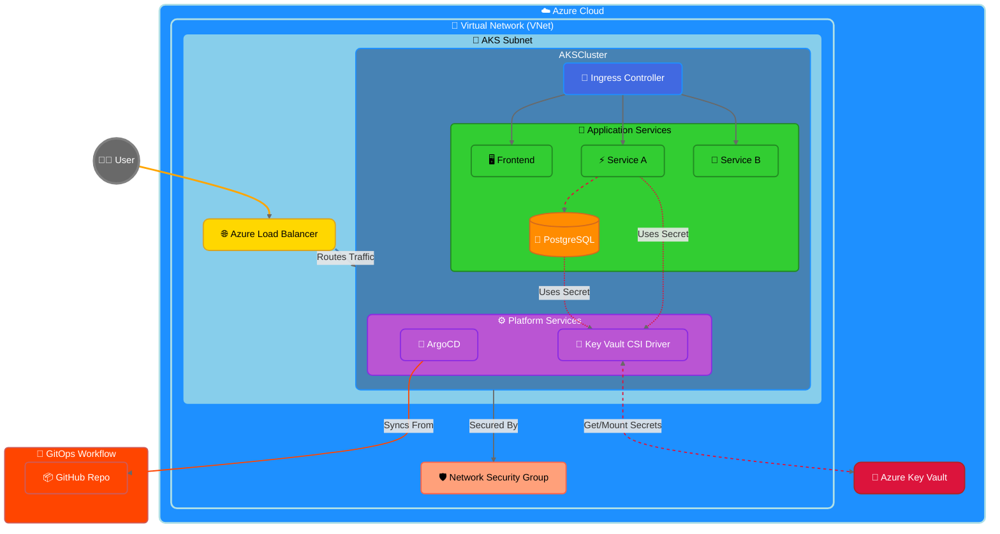

# GitOps Deployment with ArgoCD on Azure Kubernetes Service (AKS)

This repository demonstrates how to implement GitOps using ArgoCD on Azure Kubernetes Service (AKS). It provides a practical example of automating deployments to AKS using GitOps principles where your Git repository is the single source of truth.

## 🎯 What You'll Build

A complete GitOps deployment pipeline that includes:
- A modern microservices application with frontend and backend services
- Automated deployments using ArgoCD
- Secure secret management with Azure Key Vault
- Progressive delivery with canary deployments
- Infrastructure as Code using Terraform

## 🚀 Demo Application

The demo application consists of:
- A modern web frontend
- Two backend microservices:
  - Service A: Handles database operations
  - Service B: Provides random data
- PostgreSQL database for data persistence

## 🏗️ Architecture Overview


The architecture includes the following components:

- **Azure Kubernetes Service (AKS)**: Managed Kubernetes cluster on Azure
- **ArgoCD**: GitOps continuous delivery tool that automates the deployment of applications to Kubernetes
- **Azure Key Vault**: Secure storage for secrets
- **Terraform**: Infrastructure as Code tool to provision Azure resources
- **GitHub Actions**: CI/CD pipeline to build and deploy the application
- **Microservices**: Sample application with frontend, service-a, service-b, and PostgreSQL database

## 🔄 Network & Application Topology



### 🎨 Diagram Interpretation


1.  **External Access**: User traffic hits the Azure Load Balancer (`🌐`), which fronts the AKS cluster.
2.  **Azure Networking**: The AKS cluster resides within a dedicated Subnet (`🔌`), which is part of a Virtual Network (`🔗`). Network Security Groups (`🛡️`) control traffic flow into the subnet.
3.  **Ingress Routing**: Inside AKS, the Load Balancer routes traffic to the Ingress Controller (`🚦`), which then directs requests to the appropriate application services (`🌟`).
4.  **Internal Communication**: Services like Service A (`⚡`) communicate internally with the PostgreSQL database (`💾`).
5.  **Secret Management**: The Key Vault CSI Driver (`🔐`) securely fetches secrets from Azure Key Vault (`🔑`) and mounts them for use by applications and the database.
6.  **GitOps Flow**: ArgoCD (`🔄`) pulls configuration from the GitHub Repository (`📦`) to manage deployments.


## ✅ Prerequisites

Before you begin, ensure you have:
- Azure Subscription (free tier works for this demo)
- GitHub account
- Azure CLI installed (`az --version`)
- kubectl installed (`kubectl version`)
- Terraform installed (`terraform --version`)

## 📁 Repository Structure

```
.
├── frontend/               # Frontend web application
├── service-a/             # Backend service A (with DB access)
├── service-b/             # Backend service B
├── kubernetes/            # Raw Kubernetes manifests
├── helm-chart/            # Helm chart for deployment
├── argo-cd/              # ArgoCD configuration
├── terraform/            # Infrastructure as Code
└── .github/workflows/    # CI/CD pipeline
```

## Step-by-Step Guide

### 1. Fork and Clone the Repository

```bash
git clone https://github.com/your-username/kubemicrodemo.git
cd kubemicrodemo
```

### 2. Set up GitHub Secrets

Add the following secrets to your GitHub repository:

- `AZURE_CLIENT_ID`: Azure service principal client ID
- `AZURE_CLIENT_SECRET`: Azure service principal client secret
- `AZURE_TENANT_ID`: Azure tenant ID
- `AZURE_SUBSCRIPTION_ID`: Azure subscription ID
- `TERRAFORM_STORAGE_RG`: Resource group for Terraform state storage
- `TERRAFORM_STORAGE_ACCOUNT`: Storage account for Terraform state
- `TERRAFORM_CONTAINER`: Storage container for Terraform state
- `DB_USERNAME`: Database username
- `DB_PASSWORD`: Database password
- `AKS_RESOURCE_GROUP`: Resource group for AKS cluster (default: aks-gitops-rg)
- `AKS_CLUSTER_NAME`: Name of the AKS cluster (default: aks-gitops-cluster)

### 3. Create Azure Service Principal

   ```bash
# Login to Azure
az login

# Create service principal
   az ad sp create-for-rbac --name "kubemicrodemo-sp" --role contributor --scopes /subscriptions/<subscription-id> --sdk-auth
   ```

Take note of the output, which will contain the client ID, client secret, and tenant ID needed for GitHub secrets.

### 4. Set up Terraform State Storage

   ```bash
   # Create resource group
   az group create --name kubemicrodemo-terraform-storage-rg --location eastus
   
   # Create storage account
az storage account create \
  --resource-group kubemicrodemo-terraform-storage-rg \
  --name tfstatekubemicro \
  --sku Standard_LRS \
  --encryption-services blob
   
   # Create container
az storage container create \
  --name tfstate \
  --account-name tfstatekubemicro
```

### 5. Update Repository Configuration

1. In `argo-cd/application.yaml`, update the repository URL:

```yaml
source:
  repoURL: https://github.com/your-username/kubemicrodemo.git
```

2. In `helm-chart/values.yaml`, update the image repository names:

```yaml
frontend:
  image:
    repository: ghcr.io/your-username/kubemicrodemo/frontend

serviceA:
  image:
    repository: ghcr.io/your-username/kubemicrodemo/service-a

serviceB:
  image:
    repository: ghcr.io/your-username/kubemicrodemo/service-b
```

### 6. Automated Deployment with GitHub Actions

Once you've set up the GitHub secrets and updated the configuration, push your changes to the main branch. The GitHub Actions workflow will:

1. Build and push Docker images to GitHub Container Registry
2. Deploy infrastructure with Terraform
3. Install ArgoCD on the AKS cluster
4. Install the Azure Key Vault CSI Driver
5. Deploy the application with ArgoCD

   ```bash
git add .
git commit -m "Initial setup for GitOps deployment"
git push
   ```

### 7. Manual Deployment Guide

Follow these steps to deploy the application manually:

#### 1. Clean Up (If needed)
```bash
# Delete existing namespaces if you want to start fresh
kubectl delete ns argocd prod csi-secrets-store
```

#### 2. Install ArgoCD
```bash
# Create argocd namespace and install ArgoCD
kubectl create namespace argocd
kubectl apply -n argocd -f https://raw.githubusercontent.com/argoproj/argo-cd/stable/manifests/install.yaml

# Wait for ArgoCD server to be ready
kubectl wait --for=condition=available --timeout=600s deployment/argocd-server -n argocd

# Get ArgoCD admin password
kubectl -n argocd get secret argocd-initial-admin-secret -o jsonpath="{.data.password}" | base64 -d
echo  # Print a newline

# Access ArgoCD UI (in a new terminal)
kubectl port-forward svc/argocd-server -n argocd 8080:443
```
You can now access ArgoCD UI at: http://localhost:8080
- Username: admin
- Password: (use the password from the previous step)

#### 3. Install Azure Key Vault CSI Driver
```bash
# Install CSI driver and provider
kubectl apply -f argo-cd/key-vault-csi-driver-installer.yaml

# Wait for the CSI driver to be ready
kubectl wait --for=condition=established --timeout=120s crd/secretproviderclasses.secrets-store.csi.x-k8s.io
```

#### 4. Configure Secret Provider
```bash
# Update the tenant ID in the secret provider configuration
# Replace YOUR_TENANT_ID with your Azure Tenant ID
export TENANT_ID="YOUR_TENANT_ID"
sed "s/\${TENANT_ID}/$TENANT_ID/" argo-cd/secret-provider.yaml | kubectl apply -f -
```

#### 5. Deploy Application
```bash
# Update the repository URL in application.yaml (replace with your repository URL)
sed -i "s|https://github.com/your-username/kubemicrodemo.git|$YOUR_REPO_URL|g" argo-cd/application.yaml

# Deploy the application
kubectl apply -f argo-cd/application.yaml
```

#### 6. Verify Deployment
```bash
# Check application status
kubectl get applications -n argocd

# Get the frontend service URL
kubectl get svc frontend

# Get all pods status
kubectl get pods -A
```

#### Troubleshooting

1. If pods are not starting:
   ```bash
   kubectl describe pod <pod-name>
   kubectl logs <pod-name>
   ```

2. If ArgoCD is not syncing:
   ```bash
   kubectl get applications -n argocd
   kubectl describe application -n argocd microservices-demo
   ```

3. If secrets are not working:
   ```bash
   kubectl describe secretproviderclass azure-keyvault-provider
   kubectl describe pod -l app=service-a
   ```

## Accessing the Application

After deployment, you can access the following services:

1. **Application Services** through the Ingress Controller:
   ```bash
   # Get the Ingress Controller's external IP
   export INGRESS_IP=$(kubectl get svc -n ingress-nginx ingress-nginx-controller -o jsonpath='{.status.loadBalancer.ingress[0].ip}')
   
   # Access URLs
   echo "Frontend UI: http://$INGRESS_IP/frontend/"
   echo "Service A API: http://$INGRESS_IP/api/service-a/data"
   echo "Service B API: http://$INGRESS_IP/api/service-b/data"
   ```

2. **ArgoCD Dashboard**:
   ```bash
   # Get ArgoCD server external IP
   export ARGOCD_IP=$(kubectl get svc -n argocd argocd-server -o jsonpath='{.status.loadBalancer.ingress[0].ip}')
   echo "ArgoCD UI: http://$ARGOCD_IP"
   
   # Get initial admin password
   kubectl -n argocd get secret argocd-initial-admin-secret -o jsonpath="{.data.password}" | base64 -d
   ```
   Default credentials:
   - Username: `admin`
   - Password: Use the output from the command above

   Alternatively, you can use port forwarding to access ArgoCD locally:
   ```bash
   kubectl port-forward svc/argocd-server -n argocd 8080:443
   # Access ArgoCD at http://localhost:8080
   ```

3. **Service Architecture**:
   - All application services are exposed through the Ingress Controller
   - Services use `externalTrafficPolicy: Local` for optimal routing and client source IP preservation
   - Internal services (postgres, etc.) are only accessible within the cluster
   - All external traffic is routed through the ingress-nginx controller with TLS termination

4. **Verifying Service Status**:
   ```bash
   # Check ingress-nginx service (provides external access)
   kubectl get svc -n ingress-nginx

   # Check application services
   kubectl get svc -n microservices-demo

   # Check ArgoCD service
   kubectl get svc -n argocd
   ```

5. **Monitoring Service Health**:
   ```bash
   # Check pods status
   kubectl get pods -n microservices-demo

   # Check ingress configuration
   kubectl get ingress -n microservices-demo

   # View service logs (examples)
   kubectl logs -l app=frontend -n microservices-demo
   kubectl logs -l app=service-a -n microservices-demo
   kubectl logs -l app=service-b -n microservices-demo
   ```

6. **Security Best Practices**:
   - All sensitive information is stored in Azure Key Vault
   - Services communicate over internal network within the cluster
   - External access is controlled through ingress rules
   - Network policies can be enabled for additional security
   - Regular monitoring and logging are enabled for all services

## How GitOps Works with ArgoCD

1. **Git as Single Source of Truth**: All Kubernetes manifests and Helm charts are stored in Git
2. **Declarative**: Define the desired state of your application in Git
3. **Automated Sync**: ArgoCD continuously monitors the Git repository for changes
4. **Self-Healing**: ArgoCD automatically corrects drift between Git and the cluster state

When you make changes to your application:

1. Update the Kubernetes manifests or Helm charts in Git
2. Commit and push the changes
3. ArgoCD detects the changes and automatically applies them to the cluster

This provides:
- Improved reliability and consistency
- Easier rollbacks (just revert Git commits)
- Better auditability (Git history tracks all changes)
- Enhanced collaboration (using Git pull requests)

## Secret Management with Azure Key Vault

This demo uses Azure Key Vault CSI Driver to securely manage secrets:

1. Secrets are stored in Azure Key Vault
2. The CSI Driver authenticates with Azure using the AKS managed identity
3. Secrets are mounted into pods as files or environment variables
4. No secrets are stored in the Git repository or Kubernetes manifests

## Progressive Delivery with Canary Deployments

For production deployments, this setup includes canary deployment configuration:

1. New versions are rolled out to a small percentage of users first
2. The system monitors performance and error metrics
3. If metrics are good, the rollout continues to more users
4. If issues are detected, the rollout is automatically rolled back

Enable canary deployments by setting `canary.enabled: true` in the Helm values.

## Troubleshooting

### Azure Quota Errors

If you encounter Azure quota errors during deployment, try:
- Reducing the node count in terraform/variables.tf
- Using a smaller VM size
- Requesting a quota increase from Azure
- Trying a different Azure region

### ArgoCD Sync Issues

If ArgoCD fails to sync applications:
1. Check the ArgoCD dashboard for error messages
2. Verify that the Git repository URL is correct
3. Ensure the Kubernetes cluster has internet access to pull images

## Clean Up

To delete all resources:

```bash
# Using Terraform
cd terraform
terraform destroy

# Or using Azure CLI directly
az group delete --name aks-gitops-rg --yes
az group delete --name kubemicrodemo-terraform-storage-rg --yes
```

## 🎓 Learning Outcomes

After completing this tutorial, you'll understand:
- How GitOps works in practice with ArgoCD
- Managing Kubernetes deployments declaratively
- Implementing secure secret management in Kubernetes
- Setting up progressive delivery with canary deployments
- Using Infrastructure as Code with Terraform

## 🔍 What's Next?

After setting up this demo, you can explore:
1. Adding more microservices to the application
2. Implementing monitoring with Prometheus and Grafana
3. Setting up automated testing in the CI/CD pipeline
4. Adding custom metrics for canary analysis

## 📚 Additional Resources

- [ArgoCD Documentation](https://argo-cd.readthedocs.io/)
- [Azure Kubernetes Service Documentation](https://docs.microsoft.com/azure/aks/)
- [GitOps Principles](https://www.gitops.tech/)
- [Terraform on Azure Documentation](https://learn.hashicorp.com/collections/terraform/azure-get-started)

## 🤝 Contributing

Contributions are welcome! Please feel free to submit a Pull Request.

## 📝 License

This project is licensed under the MIT License - see the [LICENSE](LICENSE) file for details. 