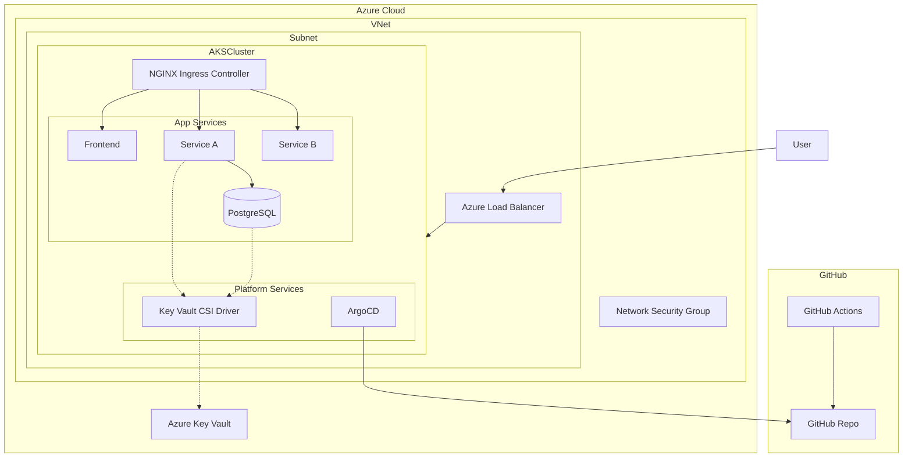

# GitOps Deployment with ArgoCD on Azure Kubernetes Service (AKS)

👋 Welcome! This repository demonstrates a complete GitOps deployment pipeline using ArgoCD on Azure Kubernetes Service (AKS).

## 📚 Documentation Overview

1.  [Prerequisites](#-prerequisites) - What you need before starting.
2.  [Setup (One-Time Manual Steps)](#-setup-one-time-manual-steps) - Creating credentials and backend storage.
3.  [Configure GitHub Secrets](#-configure-github-secrets) - Adding credentials to your repository.
4.  [Automated Deployment (CI/CD)](#-automated-deployment-cicd) - Running the main deployment workflow.
5.  [Accessing the Application](#-accessing-the-application) - Getting your application URLs.
6.  [Architecture](#-architecture-overview)
7.  [Troubleshooting](#-quick-troubleshooting-guide)
8.  [Cleanup](#-cleanup)
9.  [Manual Deployment (Optional)](#-manual-deployment-guide-optional)
10. [Other Sections](#-other-sections) (How GitOps Works, Secret Management, etc.)

---

## ✅ Prerequisites

Before you begin, ensure you have:

*   **Azure Account:** An active Azure Subscription ([Get a free account](https://azure.microsoft.com/free/)).
*   **GitHub Account:** To fork and manage the repository.
*   **Forked Repository:** Fork this repository `https://github.com/wahaj4311/3-tier-app.git` to your GitHub account.
*   **Required Tools Installed:**
    *   [Azure CLI](https://docs.microsoft.com/cli/azure/install-azure-cli): `az --version`
    *   [kubectl](https://kubernetes.io/docs/tasks/tools/): `kubectl version --client`
    *   [Terraform](https://www.terraform.io/downloads.html): `terraform --version`
    *   [jq](https://stedolan.github.io/jq/download/): (For easy credential extraction) `jq --version`
    *   [GitHub CLI](https://cli.github.com/) (Optional, for triggering workflows): `gh --version`

---

## ⚙️ Setup (One-Time Manual Steps)

These steps create the necessary Azure credentials and the remote backend storage for Terraform. **This only needs to be done once per setup.**

```bash
# --- Step 1: Login to Azure CLI ---
az login

# --- Step 2: Create Azure Service Principal ---
# Replace <your-subscription-id> with your actual Azure Subscription ID.
# This command creates credentials for GitHub Actions to interact with Azure.
# The output (JSON) is saved to 'sp_output.json'. Keep this file safe.
echo "Creating Azure Service Principal..."
az ad sp create-for-rbac --name "kubemicrodemo-sp-$(date +%s)" \
  --role contributor \
  --scopes /subscriptions/<your-subscription-id> \
  --sdk-auth > sp_output.json

if [ $? -ne 0 ]; then
  echo "Error creating Service Principal. Please check Azure permissions and subscription ID."
  exit 1
fi
echo "Service Principal created. Credentials saved to sp_output.json"

# --- Step 3: Create Terraform Backend Storage ---
# This uses Terraform locally (with the SP created above) to create the
# Azure Storage Account and Container where the main infrastructure state will live.
echo "Creating Terraform backend storage..."
cd terraform/bootstrap

# Initialize Terraform (uses local state for this bootstrap step)
terraform init -reconfigure

# Plan and Apply to create the storage resources.
# It uses the Service Principal credentials from sp_output.json.
export ARM_CLIENT_ID=$(cat ../../sp_output.json | jq -r .clientId)
export ARM_CLIENT_SECRET=$(cat ../../sp_output.json | jq -r .clientSecret)
export ARM_TENANT_ID=$(cat ../../sp_output.json | jq -r .tenantId)
export ARM_SUBSCRIPTION_ID=<your-subscription-id> # Replace with your Subscription ID

# You can also pass variables directly if preferred:
# TF_VAR_client_id=$ARM_CLIENT_ID TF_VAR_client_secret=$ARM_CLIENT_SECRET ... terraform plan/apply

terraform plan -out=bootstrap.tfplan \
  -var="client_id=$ARM_CLIENT_ID" \
  -var="client_secret=$ARM_CLIENT_SECRET" \
  -var="tenant_id=$ARM_TENANT_ID" \
  -var="subscription_id=$ARM_SUBSCRIPTION_ID" \
  -var="location=eastus" # Optional: Change location if needed

if [ $? -ne 0 ]; then
  echo "Error planning Terraform bootstrap. Check variables and SP permissions."
  cd ../..
  exit 1
fi

terraform apply -auto-approve bootstrap.tfplan

# --- Handling Potential Naming Conflicts ---
# The bootstrap code attempts to create a storage account named 'tfstatekubemicro'.
# Storage account names must be globally unique in Azure. If the previous command
# failed due to a naming conflict (e.g., "StorageAccountAlreadyTaken"), 
# you need to manually choose a unique name:
#   1. Edit the file: terraform/bootstrap/main.tf
#   2. Find the 'azurerm_storage_account' resource block.
#   3. Change the 'name' argument from "tfstatekubemicro" to a unique name 
#      (e.g., "tfstate<yourinitials><date>").
#   4. Re-run 'terraform plan -out=bootstrap.tfplan ...' and 'terraform apply bootstrap.tfplan' above.
#   5. IMPORTANT: Remember the unique name you used! You'll need it for the GitHub secret.

if [ $? -ne 0 ]; then
  echo "Error applying Terraform bootstrap. Check Azure status, permissions, or potential naming conflicts."
  cd ../..
  exit 1
fi

echo "Terraform backend storage created successfully."

# --- Step 4: Navigate back and cleanup (optional) ---
cd ../..
# Consider deleting sp_output.json after adding secrets to GitHub, or store it securely.
# echo "Setup complete. Remember to add the required secrets to your GitHub repository."
# rm sp_output.json
```

---

## 🔒 Configure GitHub Secrets

After completing the one-time setup, go to your forked repository on GitHub -> Settings -> Secrets and variables -> Actions -> "New repository secret" and add the following:

*   **Credentials from Service Principal (`sp_output.json`):**
    *   `AZURE_CLIENT_ID`: (Value of `clientId` from `sp_output.json`)
    *   `AZURE_CLIENT_SECRET`: (Value of `clientSecret` from `sp_output.json`)
    *   `AZURE_TENANT_ID`: (Value of `tenantId` from `sp_output.json`)
    *   `AZURE_SUBSCRIPTION_ID`: Your Azure Subscription ID.
*   **Terraform Backend Details (Resource Group & Container are fixed):**
    *   `TERRAFORM_STORAGE_RG`: `kubemicrodemo-terraform-storage-rg`
    *   `TERRAFORM_STORAGE_ACCOUNT`: `tfstatekubemicro` **(or the unique name you chose if the default was taken)**
    *   `TERRAFORM_CONTAINER`: `tfstate`
*   **Application Secrets:**
    *   `DB_USERNAME`: Desired username for the application database (e.g., `postgresadmin`).
    *   `DB_PASSWORD`: Desired **strong** password for the application database.
*   **Optional AKS Naming (Defaults are used if not set):**
    *   `AKS_RESOURCE_GROUP`: (Default: `aks-gitops-rg`)
    *   `AKS_CLUSTER_NAME`: (Default: `aks-gitops-cluster`)

**Important:** Ensure these secrets are added accurately before proceeding.

---

## ▶️ Automated Deployment for Development Environment

With prerequisites met and secrets configured, the deployment process for the **development environment** uses GitHub Actions workflows. There are three main workflows you'll interact with:

1. **CI Pipeline** (`ci.yml`) - Builds and validates application components
2. **Deploy to AKS** (`deploy.yml`) - Manages infrastructure and bootstraps tools  
3. **Deploy ArgoCD Applications** (`argocd-deploy.yml`) - Deploys applications via ArgoCD

### Development Environment Considerations

For development environments:
* The AKS cluster is assumed to exist already (created outside of these workflows or manually)
* Workflow execution is primarily manual to give you control over the deployment process
* The primary focus is on rapid iteration and testing, not infrastructure provisioning

### When to Run Each Workflow in Development

Here's a clear breakdown of when to use each workflow for development:

#### 1. CI Pipeline Workflow (`ci.yml`)
**Purpose:** Builds Docker images, validates Helm charts, and updates image tags in the values file

**When to run:**
* After making changes to application code (frontend, service-a, service-b)
* After modifying the Helm chart
* Before deploying to check that everything builds correctly

**How it's triggered:**
* Automatically on push to `dev` branch
* Manually via GitHub UI: Actions → CI Pipeline → Run workflow → environment=dev

#### 2. Deploy to AKS Workflow (`deploy.yml`)
**Purpose:** For dev environments, this workflow primarily builds images and runs `terraform plan` without applying changes.

**When to run:**
* When you need to validate infrastructure changes without applying them
* When you want to build and push images in a workflow that doesn't automatically update ArgoCD

**How it's triggered:**
* Manually via GitHub UI: Actions → Deploy to AKS → Run workflow → environment=dev

> **Note:** For development, this workflow doesn't create AKS clusters or apply Terraform changes. It simply builds images and validates infrastructure configuration.

#### 3. Deploy ArgoCD Applications Workflow (`argocd-deploy.yml`)
**Purpose:** This is your primary deployment workflow. It ensures ArgoCD is installed and properly configured on your cluster, then deploys your application manifests.

**When to run:**
* After the CI Pipeline has successfully built your images
* When you want to deploy or update your application in the dev environment
* When you want to apply changes to your Kubernetes manifests

**How it's triggered:**
* Manually via GitHub UI: Actions → Deploy ArgoCD Applications → Run workflow → environment=dev, action=deploy
* Automatically after successful completion of other workflows (optional configuration)

**What it does:**
* Connects to your existing AKS cluster
* Ensures ArgoCD, NGINX Ingress, and Azure Key Vault CSI Driver are installed
* Applies the ArgoCD Application manifest for the dev environment
* Monitors the deployment until it completes

### Development Workflow - Practical Execution Sequence

For a typical development cycle:

1. **Make code changes** to your application or Helm chart
2. **Push changes** to your repository (to the `dev` branch)
3. **CI Pipeline runs automatically** to build and validate (or run it manually)
4. **Deploy to ArgoCD** by running the `argocd-deploy.yml` workflow with environment=dev

### Workflow Execution Overview for Development

| Step | Which Workflow | What It Does |
|------|---------------|--------------|
| 1 | **CI Pipeline** (`ci.yml`) | Builds & pushes Docker images, updates image tags in values file, validates Helm chart |
| 2 | **Deploy ArgoCD Applications** (`argocd-deploy.yml`) | Ensures ArgoCD/tools are installed, deploys application via ArgoCD |
| Optional | **Deploy to AKS** (`deploy.yml`) | For dev: Builds images, runs terraform plan (validation only) |

**Remember:** The development environment assumes you already have a working AKS cluster where the applications will be deployed. The ArgoCD deployment workflow ensures the necessary components (ArgoCD, Ingress, CSI Driver) are installed on this existing cluster.

## 🧪 Development Workflow - Quick Reference

For those working in the development environment, here's a straightforward guide on which workflow to run and when:

### Step 1: Build and Push Images (When you make code changes)
**Run the "CI Pipeline" workflow (`ci.yml`)**
* This workflow builds your Docker images and validates the Helm chart
* **When to run:** After making changes to application code or Helm chart
* **Trigger:** Automatically runs on push to `dev` branch OR can be run manually
* **Manual trigger:** GitHub UI → Actions → CI Pipeline → Run workflow → Input: environment=dev

### Step 2: Deploy Application to Dev Environment
**Run the "Deploy ArgoCD Applications" workflow (`argocd-deploy.yml`)**
* This workflow deploys your application via ArgoCD
* **When to run:** After Step 1 completes OR when you want to update the deployed application
* **Inputs:** 
  * environment: `dev`
  * action: `deploy`
* **Manual trigger:** GitHub UI → Actions → Deploy ArgoCD Applications → Run workflow

### Workflow Execution Overview for Development

| When to Run | Which Workflow | What It Does |
|-------------|---------------|--------------|
| After code changes | **CI Pipeline** (`ci.yml`) | Builds & pushes Docker images, updates image tags in values file, validates Helm chart |
| After CI completes | **Deploy ArgoCD Applications** (`argocd-deploy.yml`) | Ensures ArgoCD/tools are installed, deploys application via ArgoCD |
| When destroying the dev environment | **Deploy ArgoCD Applications** (`argocd-deploy.yml`) with action=destroy | Removes ArgoCD applications and related resources |

> **Important Note:** The "Deploy to AKS" workflow (`deploy.yml`) with environment=dev is typically NOT needed for development work as it only builds images and runs `terraform plan`. Use the CI Pipeline workflow instead for building images in development.

**Remember:** The development environment assumes you already have a working AKS cluster where the applications will be deployed. The deploy workflow ensures the necessary components (ArgoCD, Ingress, CSI Driver) are installed on this existing cluster.

---

## 🌐 Accessing the Application

After the workflow completes successfully (allow a few minutes for IPs to be assigned):

1.  **Application Services:**
    ```bash
    # Get the Ingress Controller's external IP
    INGRESS_IP=$(kubectl get svc -n ingress-nginx ingress-nginx-controller -o jsonpath='{.status.loadBalancer.ingress[0].ip}')
    while [ -z "$INGRESS_IP" ]; do echo "Waiting for Ingress IP..."; sleep 10; INGRESS_IP=$(kubectl get svc -n ingress-nginx ingress-nginx-controller -o jsonpath='{.status.loadBalancer.ingress[0].ip}'); done

    # Access URLs
    echo "-------------------------------------"
    echo "Application URLs:"
    echo "Frontend UI: http://$INGRESS_IP/frontend/"
    echo "Service A API: http://$INGRESS_IP/api/service-a/"
    echo "Service B API: http://$INGRESS_IP/api/service-b/"
    echo "-------------------------------------"
    ```

2.  **ArgoCD Dashboard:**
    ```bash
    # Get ArgoCD server external IP
    ARGOCD_IP=$(kubectl get svc -n argocd argocd-server -o jsonpath='{.status.loadBalancer.ingress[0].ip}')
    while [ -z "$ARGOCD_IP" ]; do echo "Waiting for ArgoCD IP..."; sleep 10; ARGOCD_IP=$(kubectl get svc -n argocd argocd-server -o jsonpath='{.status.loadBalancer.ingress[0].ip}'); done

    # Get initial admin password
    ARGO_PASS=$(kubectl -n argocd get secret argocd-initial-admin-secret -o jsonpath="{.data.password}" | base64 -d)

    echo "-------------------------------------"
    echo "ArgoCD Dashboard:"
    echo "URL: https://$ARGOCD_IP"
    echo "Username: admin"
    echo "Password: $ARGO_PASS"
    echo "-------------------------------------"
    ```
    *Alternatively, use port forwarding:* `kubectl port-forward svc/argocd-server -n argocd 8080:443` *(Access at `https://localhost:8080`)*

---

## 🏗️ Architecture Overview


The architecture includes the following components:

- **Azure Kubernetes Service (AKS)**: Managed Kubernetes cluster on Azure
- **ArgoCD**: GitOps continuous delivery tool that automates the deployment of applications to Kubernetes
- **Azure Key Vault**: Secure storage for secrets
- **Terraform**: Infrastructure as Code tool to provision Azure resources
- **GitHub Actions**: CI/CD pipeline to build and deploy the application
- **Microservices**: Sample application with frontend, service-a, service-b, and PostgreSQL database

**Diagram:**



### 🎨 Diagram Interpretation

1.  **External Access**: User traffic hits the Azure Load Balancer (`🌐`), which fronts the AKS cluster.
2.  **Azure Networking**: The AKS cluster resides within a dedicated Subnet (`🔌`), which is part of a Virtual Network (`🔗`). Network Security Groups (`🛡️`) control traffic flow into the subnet.
3.  **Ingress Routing**: Inside AKS, the Load Balancer routes traffic to the Ingress Controller (`🚦`), which then directs requests to the appropriate application services (`🌟`).
4.  **Internal Communication**: Services like Service A (`⚡`) communicate internally with the PostgreSQL database (`💾`).
5.  **Secret Management**: The Key Vault CSI Driver (`🔐`) securely fetches secrets from Azure Key Vault (`🔑`) and mounts them for use by applications and the database.
6.  **GitOps Flow**: ArgoCD (`🔄`) pulls configuration from the GitHub Repository (`📦`) to manage deployments.

---

## 🔍 Quick Troubleshooting Guide

If the application is not accessible:

   a. Check ingress controller status:
   ```bash
   kubectl get pods -n ingress-nginx
   kubectl get svc -n ingress-nginx ingress-nginx-controller
   ```

   b. Verify application pods:
   ```bash
   kubectl get pods -n microservices-dev
   ```

   c. Check ingress rules:
```bash
   kubectl get ingress -n microservices-dev
   ```

   d. View service logs:
   ```bash
   # Frontend logs
   kubectl logs -l app=frontend -n microservices-dev --tail=50
   # Service A logs
   kubectl logs -l app=service-a -n microservices-dev --tail=50
   # Service B logs
   kubectl logs -l app=service-b -n microservices-dev --tail=50
   ```

   e. ArgoCD sync issues:
   ```bash
   # Check ArgoCD application status
   kubectl get applications -n argocd microservices-dev -o yaml
   
   # Check ArgoCD repo server logs
   kubectl logs -n argocd -l app.kubernetes.io/name=argocd-repo-server --tail=50

   # Force a refresh of ArgoCD's cache
   kubectl patch application microservices-dev -n argocd -p '{"metadata": {"annotations": {"argocd.argoproj.io/refresh": "hard"}}}' --type merge
   
   # Force a sync if auto-sync is off or stuck
   # kubectl patch application microservices-dev -n argocd --type merge -p '{"operation": {"sync": {}}}'
   ```

--- 

## 🧹 Cleanup

To remove all resources created by this setup:

*   **Option 1: Automated via GitHub Actions (Recommended)**
    ```bash
    # Trigger the destroy workflow
    gh workflow run "Deploy ArgoCD Applications" -f environment=all -f action=destroy
    ```
    This workflow should:
    1.  Delete the ArgoCD applications.
    2.  Uninstall ArgoCD, Ingress Controller, CSI Driver.
    3.  Use Terraform to destroy the Azure infrastructure (AKS, Key Vault, etc.).

*   **Option 2: Manual Cleanup (Use if automated cleanup fails)**
    1.  **Delete Kubernetes Resources:**
        ```bash
        kubectl delete namespace argocd microservices-dev ingress-nginx csi-secrets-store --ignore-not-found=true
        # Might need to wait or force delete if namespaces are stuck
        ```
    2.  **Destroy Terraform Infrastructure:**
        ```bash
        # Navigate to the main terraform directory
        cd terraform
        
        # Initialize with the remote backend
        terraform init -reconfigure \
          -backend-config="resource_group_name=kubemicrodemo-terraform-storage-rg" \
          -backend-config="storage_account_name=<STORAGE_ACCOUNT_NAME>" \
          -backend-config="container_name=tfstate" \
          -backend-config="key=terraform-prod.tfstate" # Adjust key based on environment if needed
        
        # Destroy the main infrastructure (AKS, Key Vault, etc.)
        terraform destroy -auto-approve
        
        # Navigate back
        cd ..
        ```
    3.  **Destroy Terraform Bootstrap Resources:**
        ```bash
        # Navigate to the bootstrap directory
        cd terraform/bootstrap
        
        # Initialize locally
        terraform init -reconfigure
        
        # Destroy the backend storage resources
        terraform destroy -auto-approve \
          -var="client_id=<your_azure_client_id>" \
          -var="client_secret=<your_azure_client_secret>" \
          -var="tenant_id=<your_azure_tenant_id>" \
          -var="subscription_id=<your_azure_subscription_id>"
          
        # Navigate back
        cd ../..
        ```
    4.  **Delete Azure Service Principal (Optional):**
   ```bash
        # Find the SP ID (if you don't have it)
        az ad sp list --display-name kubemicrodemo-sp-<timestamp> --query "[].id" -o tsv
        # Delete using the ID
        az ad sp delete --id <service-principal-id>
        ```

---

## 📜 Manual Deployment Guide (Optional)

These steps are **not required** if using the automated GitHub Actions deployment. They are provided for reference or if you need to perform steps individually.

#### 1. Clean Up (If needed)
```bash
# Delete existing namespaces if you want to start fresh
kubectl delete ns argocd microservices-dev csi-secrets-store ingress-nginx --ignore-not-found=true
```

#### 2. Install ArgoCD
```bash
# Create argocd namespace and install ArgoCD
kubectl create namespace argocd
kubectl apply -n argocd -f https://raw.githubusercontent.com/argoproj/argo-cd/stable/manifests/install.yaml

# Wait for ArgoCD server to be ready (may take a few minutes)
kubectl wait --for=condition=available --timeout=600s deployment/argocd-server -n argocd

# (Get password and access UI as described in Accessing section)
```

#### 3. Install NGINX Ingress Controller
```bash
helm repo add ingress-nginx https://kubernetes.github.io/ingress-nginx
helm repo update
helm install ingress-nginx ingress-nginx/ingress-nginx \
  --namespace ingress-nginx \
  --create-namespace \
  --set controller.service.externalTrafficPolicy=Local \
  --wait
```

#### 4. Install Azure Key Vault CSI Driver
```bash
# Apply the installer manifest (ensure it targets the correct charts/versions)
kubectl apply -f argo-cd/key-vault-csi-driver-installer.yaml

# Wait for the necessary CRD to be established
kubectl wait --for=condition=established --timeout=180s crd/secretproviderclasses.secrets-store.csi.x-k8s.io
```

#### 5. Configure Secret Provider Class
```bash
# Update the tenant ID in the secret provider configuration
# Assumes your tenant ID is in $ARM_TENANT_ID or replace manually
cp argo-cd/secret-provider.yaml temp-spc.yaml
sed -i "s/\${TENANT_ID}/$ARM_TENANT_ID/" temp-spc.yaml
kubectl apply -f temp-spc.yaml -n microservices-dev # Apply in your app namespace
rm temp-spc.yaml
```

#### 6. Deploy Application via ArgoCD Manifests
```bash
# Create the application namespace if it doesn't exist
kubectl create ns microservices-dev --dry-run=client -o yaml | kubectl apply -f -

# Apply the ArgoCD project manifest
cp argo-cd/project.yaml temp-proj.yaml
sed -i "s|https://github.com/your-username/kubemicrodemo.git|$(git remote get-url origin)|g" temp-proj.yaml
kubectl apply -f temp-proj.yaml -n argocd
rm temp-proj.yaml

# Apply the ArgoCD application manifest (e.g., for dev)
cp argo-cd/applications/dev.yaml temp-app.yaml
sed -i "s|https://github.com/your-username/kubemicrodemo.git|$(git remote get-url origin)|g" temp-app.yaml
kubectl apply -f temp-app.yaml -n argocd
rm temp-app.yaml
```

#### 7. Verify Deployment
```bash
# Check ArgoCD application sync status
kubectl get applications -n argocd microservices-dev

# Check application pods
kubectl get pods -n microservices-dev

# (Access application as described in Accessing section)
```

---

