# GitOps Deployment with ArgoCD on Azure Kubernetes Service (AKS)

👋 Welcome! This repository demonstrates a complete GitOps deployment pipeline using ArgoCD on Azure Kubernetes Service (AKS).

## 🚀 Quick Start

```bash
# 1. Clone the repository
git clone https://github.com/wahaj4311/3-tier-app.git
cd 3-tier-app

# 2. Perform Prerequisites (see section below)
# Includes:
# - Installing tools (Azure CLI, kubectl, Terraform)
# - Logging into Azure
# - Creating Azure Service Principal & extracting credentials
# - Running the ONE-TIME Terraform bootstrap to create state storage
# - Setting up ALL required GitHub secrets (SP creds + TF backend names)

# 3. Deploy using GitHub Actions
# Once prerequisites are met, the CI pipeline handles the rest:
# - Connects to TF backend storage
# - Creates AKS cluster & other Azure resources (using Terraform)
# - Installs and configures ArgoCD
# - Deploys the application
# Trigger the workflow:
# Just click "Actions" tab in the repository and run "Deploy ArgoCD Applications" workflow
# Or use GitHub CLI:
gh workflow run "Deploy ArgoCD Applications" -f environment=all -f action=deploy

# 4. Get your application URLs
# Get ingress IP for the application
export INGRESS_IP=$(kubectl get svc -n ingress-nginx ingress-nginx-controller -o jsonpath='{.status.loadBalancer.ingress[0].ip}')
echo "Application URLs:"
echo "Frontend: http://$INGRESS_IP/frontend/"
echo "Service A: http://$INGRESS_IP/api/service-a/"
echo "Service B: http://$INGRESS_IP/api/service-b/"

# 5. Access ArgoCD Dashboard
export ARGOCD_IP=$(kubectl get svc -n argocd argocd-server -o jsonpath='{.status.loadBalancer.ingress[0].ip}')
echo "ArgoCD UI: https://$ARGOCD_IP"
echo "Username: admin"
echo "Get password with:"
kubectl -n argocd get secret argocd-initial-admin-secret -o jsonpath="{.data.password}" | base64 -d
```

## 🎯 What's Included?

- **Modern Web Application**: React frontend + Node.js microservices + PostgreSQL
- **GitOps with ArgoCD**: Automated deployments from Git to Kubernetes
- **Azure Integration**: AKS + Key Vault for secrets
- **CI/CD**: Complete GitHub Actions pipelines
- **Infrastructure as Code**: Azure resources (AKS, Key Vault etc.) managed via Terraform
- **Security**: Proper secret management and network policies

## 📚 Full Documentation

1. [Prerequisites](#-prerequisites)
2. [Automated Deployment (CI/CD)](#5-automated-deployment-with-github-actions)
3. [Manual Deployment (Optional)](#6-manual-deployment-guide)
4. [Architecture](#-architecture-overview)
5. [Troubleshooting](#quick-troubleshooting-guide)
6. [Cleanup](#cleanup)

## ❓ Need Help?

- 🐛 Found a bug? [Open an issue](https://github.com/wahaj4311/3-tier-app/issues)
- 🤝 Want to contribute? [Check our contributing guide](CONTRIBUTING.md)
- 💬 Questions? [Start a discussion](https://github.com/wahaj4311/3-tier-app/discussions)

## 🎯 What You'll Build

A complete GitOps deployment pipeline that includes:
- A modern microservices application with frontend and backend services
- Automated deployments using ArgoCD
- Secure secret management with Azure Key Vault
- Progressive delivery with canary deployments
- Infrastructure as Code using Terraform

## 🚀 Demo Application

The demo application consists of:
- A modern web frontend
- Two backend microservices:
  - Service A: Handles database operations
  - Service B: Provides random data
- PostgreSQL database for data persistence

## 🏗️ Architecture Overview


The architecture includes the following components:

- **Azure Kubernetes Service (AKS)**: Managed Kubernetes cluster on Azure
- **ArgoCD**: GitOps continuous delivery tool that automates the deployment of applications to Kubernetes
- **Azure Key Vault**: Secure storage for secrets
- **Terraform**: Infrastructure as Code tool to provision Azure resources
- **GitHub Actions**: CI/CD pipeline to build and deploy the application
- **Microservices**: Sample application with frontend, service-a, service-b, and PostgreSQL database

## 🔄 Network & Application Topology

```mermaid
flowchart TB
    %% Styling Definitions - Network Focus
    classDef azure fill:#1E90FF,stroke:#B0E0E6,stroke-width:3px,color:#fff,rx:10,ry:10  %% Azure blue
    classDef vnet fill:#87CEEB,stroke:#1E90FF,stroke-width:2px,color:#000,rx:8,ry:8      %% Sky blue for VNet/Subnet
    classDef aks fill:#4682B4,stroke:#1E90FF,stroke-width:2px,color:#fff,rx:8,ry:8      %% Steel blue for AKS
    classDef netsec fill:#FFA07A,stroke:#FF6347,stroke-width:2px,color:#000,rx:6,ry:6   %% Light salmon for Network Security
    classDef lb fill:#FFD700,stroke:#DAA520,stroke-width:2px,color:#000,rx:10,ry:10      %% Gold for Load Balancer
    classDef ingress fill:#4169E1,stroke:#1E90FF,stroke-width:2px,color:#fff,rx:6,ry:6   %% Royal blue for Ingress
    classDef app fill:#32CD32,stroke:#228B22,stroke-width:2px,color:#000,rx:6,ry:6      %% Lime green for Apps
    classDef platform fill:#BA55D3,stroke:#8A2BE2,stroke-width:2px,color:#fff,rx:8,ry:8 %% Medium orchid for Platform
    classDef storage fill:#FF8C00,stroke:#D2691E,stroke-width:2px,color:#fff,rx:12,ry:12 %% Dark orange for Storage
    classDef secret fill:#DC143C,stroke:#B22222,stroke-width:2px,color:#fff,rx:12,ry:12 %% Crimson for Secrets
    classDef user fill:#696969,stroke:#808080,stroke-width:4px,color:#fff,rx:20,ry:20   %% Dim gray for User
    classDef git fill:#FF4500,stroke:#CD5C5C,stroke-width:2px,color:#fff,rx:6,ry:6      %% Orange-red for Git

    %% --- Network Layer --- 
    User((🧑‍💻 User)) --> AzureLB[🌐 Azure Load Balancer]
    
    subgraph AzureCloud["☁️ Azure Cloud"]
        direction TB
        AKV[🔑 Azure Key Vault]
        
        subgraph VNet["🔗 Virtual Network (VNet)"]
            direction TB
            NSG[🛡️ Network Security Group]
            subgraph Subnet["🔌 AKS Subnet"]
                direction TB
                AzureLB -- Routes Traffic --> AKSCluster["🚀 AKS Cluster"]
                
                subgraph AKSCluster
                    direction TB
                    IC[🚦 Ingress Controller]
                    
                    subgraph AppServices["🌟 Application Services"]
                        direction LR
                        FE[🖥️ Frontend]
                        SA[⚡ Service A]
                        SB[🎲 Service B]
                        DB[(💾 PostgreSQL)]
                    end
                    
                    subgraph PlatformServices["⚙️ Platform Services"]
                        direction LR
                        AG[🔄 ArgoCD]
                        KV[🔐 Key Vault CSI Driver]
                    end
                end
            end
            AKSCluster -- Secured By --> NSG
        end
    end
    
    %% --- GitOps Layer --- 
    subgraph GitOpsWorkflow["🔄 GitOps Workflow"]
        GH[📦 GitHub Repo]
    end
    
    %% --- Connections --- 
    %% External Traffic Flow
    IC --> FE
    IC --> SA
    IC --> SB
    
    %% Internal Traffic & Dependencies
    SA --> DB
    
    %% Secret Management Flow
    KV <.-> |Get/Mount Secrets| AKV
    SA -.-> |Uses Secret| KV
    DB -.-> |Uses Secret| KV
    
    %% GitOps Sync
    AG --> |Syncs From| GH
    
    %% Apply Styling Classes
    class AzureCloud,VNet azure
    class Subnet vnet
    class AKSCluster aks
    class NSG netsec
    class AzureLB lb
    class IC ingress
    class FE,SA,SB,AppServices app
    class AG,KV,PlatformServices platform
    class DB storage
    class AKV secret
    class User user
    class GH,GitOpsWorkflow git

    %% Link Styling
    linkStyle default stroke:#696969,stroke-width:2px
    linkStyle 0 stroke:#FFA500,stroke-width:3px
    linkStyle 1 stroke:#4682B4,stroke-width:3px
    linkStyle 6,7 stroke:#DC143C,stroke-width:2px,stroke-dasharray: 5 5
    linkStyle 8,9 stroke:#DC143C,stroke-width:2px,stroke-dasharray: 2 2
    linkStyle 10 stroke:#FF4500,stroke-width:2px
```



### 🎨 Diagram Interpretation


1.  **External Access**: User traffic hits the Azure Load Balancer (`🌐`), which fronts the AKS cluster.
2.  **Azure Networking**: The AKS cluster resides within a dedicated Subnet (`🔌`), which is part of a Virtual Network (`🔗`). Network Security Groups (`🛡️`) control traffic flow into the subnet.
3.  **Ingress Routing**: Inside AKS, the Load Balancer routes traffic to the Ingress Controller (`🚦`), which then directs requests to the appropriate application services (`🌟`).
4.  **Internal Communication**: Services like Service A (`⚡`) communicate internally with the PostgreSQL database (`💾`).
5.  **Secret Management**: The Key Vault CSI Driver (`🔐`) securely fetches secrets from Azure Key Vault (`🔑`) and mounts them for use by applications and the database.
6.  **GitOps Flow**: ArgoCD (`🔄`) pulls configuration from the GitHub Repository (`📦`) to manage deployments.


## ✅ Prerequisites

Before you begin, you'll need:

### 1. Azure Account & Tools
- Azure Subscription ([Get a free account](https://azure.microsoft.com/free/))
- [Azure CLI](https://docs.microsoft.com/cli/azure/install-azure-cli) installed
  ```bash
  # Verify installation
  az --version
  ```

### 2. Development Tools
- [kubectl](https://kubernetes.io/docs/tasks/tools/) - Kubernetes command-line tool
  ```bash
  # Verify installation
  kubectl version --client
  ```
- [Terraform](https://www.terraform.io/downloads.html) - Infrastructure as Code
  ```bash
  # Verify installation
  terraform --version
  ```
- [GitHub CLI](https://cli.github.com/) (optional, for easy workflow triggers)
  ```bash
  # Verify installation
  gh --version
  ```

### 3. GitHub Setup
1. Fork this repository
2. Add the following secrets in your GitHub repository (Settings → Secrets → Actions):
   - `AZURE_CLIENT_ID`: Service principal client ID
   - `AZURE_CLIENT_SECRET`: Service principal secret
   - `AZURE_TENANT_ID`: Azure tenant ID
   - `AZURE_SUBSCRIPTION_ID`: Azure subscription ID
   - `TERRAFORM_STORAGE_RG`: Resource group for Terraform state
   - `TERRAFORM_STORAGE_ACCOUNT`: Storage account name
   - `TERRAFORM_CONTAINER`: Storage container name
   - `DB_USERNAME`: Database username
   - `DB_PASSWORD`: Database password
   - `AKS_RESOURCE_GROUP`: Resource group for AKS (default: aks-gitops-rg)
   - `AKS_CLUSTER_NAME`: AKS cluster name (default: aks-gitops-cluster)

### 4. Local Environment
```bash
# 1. Login to Azure
az login

# 2. Create service principal (save the output!)
# The output is a JSON object. Store it for the next step.
az ad sp create-for-rbac --name "kubemicrodemo-sp" \
  --role contributor \
  --scopes /subscriptions/<your-subscription-id> \
  --sdk-auth

# 3. Extract credentials from the output (requires jq)
# Make sure jq is installed (e.g., sudo apt-get install jq)
# Replace the example JSON with the actual output from the previous command
export SP_OUTPUT='{ ... JSON output from az ad sp create-for-rbac ... }'

export AZURE_CLIENT_ID=$(echo $SP_OUTPUT | jq -r .clientId)
export AZURE_CLIENT_SECRET=$(echo $SP_OUTPUT | jq -r .clientSecret)
export AZURE_TENANT_ID=$(echo $SP_OUTPUT | jq -r .tenantId)

echo "AZURE_CLIENT_ID: $AZURE_CLIENT_ID"
echo "AZURE_CLIENT_SECRET: $AZURE_CLIENT_SECRET"
echo "AZURE_TENANT_ID: $AZURE_TENANT_ID"
# Now add these values as GitHub Secrets

# NOTE: Terraform backend storage is created via bootstrap Terraform code.
# See Step-by-Step Guide below.
```

Now you're ready to proceed with the [deployment](#-quick-start)!

## 📁 Repository Structure

```
.
├── frontend/               # Frontend web application
├── service-a/             # Backend service A (with DB access)
├── service-b/             # Backend service B
├── kubernetes/            # Raw Kubernetes manifests
├── helm-chart/            # Helm chart for deployment
├── argo-cd/              # ArgoCD configuration
├── terraform/            # Infrastructure as Code
└── .github/workflows/    # CI/CD pipeline
```

## Step-by-Step Guide

### 1. Fork and Clone the Repository

```bash
git clone https://github.com/your-username/kubemicrodemo.git
cd kubemicrodemo
```

### 2. Set up GitHub Secrets

Add the following secrets to your GitHub repository:

- `AZURE_CLIENT_ID`: Azure service principal client ID
- `AZURE_CLIENT_SECRET`: Azure service principal client secret
- `AZURE_TENANT_ID`: Azure tenant ID
- `AZURE_SUBSCRIPTION_ID`: Azure subscription ID
- `TERRAFORM_STORAGE_RG`: Resource group for Terraform state storage
- `TERRAFORM_STORAGE_ACCOUNT`: Storage account for Terraform state
- `TERRAFORM_CONTAINER`: Storage container for Terraform state
- `DB_USERNAME`: Database username
- `DB_PASSWORD`: Database password
- `AKS_RESOURCE_GROUP`: Resource group for AKS cluster (default: aks-gitops-rg)
- `AKS_CLUSTER_NAME`: Name of the AKS cluster (default: aks-gitops-cluster)

### 3. Create Azure Service Principal

   ```bash
# Login to Azure
az login

# Create service principal
# Save the JSON output, you'll need it for GitHub Secrets
   az ad sp create-for-rbac --name "kubemicrodemo-sp" --role contributor --scopes /subscriptions/<subscription-id> --sdk-auth

# Example using jq to extract values (optional):
# export SP_OUTPUT='paste_json_output_here'
# echo $SP_OUTPUT | jq -r .clientId
# echo $SP_OUTPUT | jq -r .clientSecret
# echo $SP_OUTPUT | jq -r .tenantId
   ```

Take note of the output, which will contain the client ID, client secret, and tenant ID needed for GitHub secrets.

### 4. Bootstrap Terraform Backend Storage (One-time Setup)

Before running the main deployment pipeline, you need to create the Azure Storage resources for the Terraform remote state. This is done using a separate Terraform configuration.

```bash
# Navigate to the bootstrap directory
cd terraform/bootstrap

# Initialize Terraform (uses local state initially)
# Provide your Azure credentials when prompted or set them as environment variables
# (ARM_CLIENT_ID, ARM_CLIENT_SECRET, ARM_TENANT_ID, ARM_SUBSCRIPTION_ID)
terraform init

# Plan the bootstrap resources
terraform plan -out=bootstrap.tfplan \
  -var="client_id=<your_azure_client_id>" \
  -var="client_secret=<your_azure_client_secret>" \
  -var="tenant_id=<your_azure_tenant_id>" \
  -var="subscription_id=<your_azure_subscription_id>" \
  -var="location=eastus" # Optional: Change location if needed

# Apply the bootstrap plan to create the storage
terraform apply bootstrap.tfplan

# IMPORTANT: After this runs successfully, the required storage account
# ('tfstatekubemicro') and container ('tfstate') will exist in Azure.
# You also need to add the created Resource Group name ('kubemicrodemo-terraform-storage-rg'), 
# Storage Account Name, and Container Name to your GitHub Secrets:
# - TERRAFORM_STORAGE_RG: kubemicrodemo-terraform-storage-rg
# - TERRAFORM_STORAGE_ACCOUNT: tfstatekubemicro
# - TERRAFORM_CONTAINER: tfstate

# Navigate back to the root directory
cd ../..
```

### 5. Update Repository Configuration

1. In `argo-cd/application.yaml`, update the repository URL:

```yaml
source:
  repoURL: https://github.com/your-username/kubemicrodemo.git
```

2. In `helm-chart/values.yaml`, update the image repository names:

```yaml
frontend:
  image:
    repository: ghcr.io/your-username/kubemicrodemo/frontend

serviceA:
  image:
    repository: ghcr.io/your-username/kubemicrodemo/service-a

serviceB:
  image:
    repository: ghcr.io/your-username/kubemicrodemo/service-b
```

### 6. Automated Deployment with GitHub Actions

Once you've set up the GitHub secrets and updated the configuration, push your changes to the main branch. The GitHub Actions workflow will:

1. Build and push Docker images to GitHub Container Registry
2. Deploy infrastructure (AKS, Key Vault, etc.) with Terraform
3. Install ArgoCD on the AKS cluster
4. Install the Azure Key Vault CSI Driver
5. Deploy the application with ArgoCD
   
```bash
git add .
git commit -m "Initial setup for GitOps deployment"
git push
```

### 7. Manual Deployment Guide

Follow these steps to deploy the application manually:

#### 1. Clean Up (If needed)
```bash
# Delete existing namespaces if you want to start fresh
kubectl delete ns argocd prod csi-secrets-store
```

#### 2. Install ArgoCD
```bash
# Create argocd namespace and install ArgoCD
kubectl create namespace argocd
kubectl apply -n argocd -f https://raw.githubusercontent.com/argoproj/argo-cd/stable/manifests/install.yaml

# Wait for ArgoCD server to be ready
kubectl wait --for=condition=available --timeout=600s deployment/argocd-server -n argocd

# Get ArgoCD admin password
kubectl -n argocd get secret argocd-initial-admin-secret -o jsonpath="{.data.password}" | base64 -d
echo  # Print a newline

# Access ArgoCD UI (in a new terminal)
kubectl port-forward svc/argocd-server -n argocd 8080:443
```
You can now access ArgoCD UI at: http://localhost:8080
- Username: admin
- Password: (use the password from the previous step)

#### 3. Install Azure Key Vault CSI Driver
```bash
# Install CSI driver and provider
kubectl apply -f argo-cd/key-vault-csi-driver-installer.yaml

# Wait for the CSI driver to be ready
kubectl wait --for=condition=established --timeout=120s crd/secretproviderclasses.secrets-store.csi.x-k8s.io
```

#### 4. Configure Secret Provider
```bash
# Update the tenant ID in the secret provider configuration
# Replace YOUR_TENANT_ID with your Azure Tenant ID
export TENANT_ID="YOUR_TENANT_ID"
sed "s/\${TENANT_ID}/$TENANT_ID/" argo-cd/secret-provider.yaml | kubectl apply -f -
```

#### 5. Deploy Application
```bash
# Update the repository URL in application.yaml (replace with your repository URL)
sed -i "s|https://github.com/your-username/kubemicrodemo.git|$YOUR_REPO_URL|g" argo-cd/application.yaml

# Deploy the application
kubectl apply -f argo-cd/application.yaml
```

#### 6. Verify Deployment
```bash
# Check application status
kubectl get applications -n argocd

# Get the frontend service URL
kubectl get svc frontend

# Get all pods status
kubectl get pods -A
```

#### Troubleshooting

1. If pods are not starting:
   ```bash
   kubectl describe pod <pod-name>
   kubectl logs <pod-name>
   ```

2. If ArgoCD is not syncing:
   ```bash
   kubectl get applications -n argocd
   kubectl describe application -n argocd microservices-demo
   ```

3. If secrets are not working:
   ```bash
   kubectl describe secretproviderclass azure-keyvault-provider
   kubectl describe pod -l app=service-a
   ```

## Accessing the Application

After deployment, you can access the following services:

1. **Application Services** through the Ingress Controller:
   ```bash
   # Get the Ingress Controller's external IP
   export INGRESS_IP=$(kubectl get svc -n ingress-nginx ingress-nginx-controller -o jsonpath='{.status.loadBalancer.ingress[0].ip}')
   
   # Access URLs
   echo "Frontend UI: http://$INGRESS_IP/frontend/"
   echo "Service A API: http://$INGRESS_IP/api/service-a/"
   echo "Service B API: http://$INGRESS_IP/api/service-b/"
   ```

2. **ArgoCD Dashboard**:
   ```bash
   # Get ArgoCD server external IP
   export ARGOCD_IP=$(kubectl get svc -n argocd argocd-server -o jsonpath='{.status.loadBalancer.ingress[0].ip}')
   echo "ArgoCD UI: https://$ARGOCD_IP"
   ```
   - Username: `admin`
   - Get password with: 
     ```bash
     kubectl -n argocd get secret argocd-initial-admin-secret -o jsonpath="{.data.password}" | base64 -d
     ```

   Alternatively, you can use port forwarding to access ArgoCD locally:
   ```bash
   kubectl port-forward svc/argocd-server -n argocd 8080:443
   # Then access ArgoCD at: https://localhost:8080
   ```

3. **Service Architecture**:
   - All application services are exposed through the NGINX Ingress Controller
   - Services use `externalTrafficPolicy: Local` for optimal routing and client source IP preservation
   - Internal services (postgres, etc.) are only accessible within the cluster
   - All external traffic is routed through the ingress-nginx controller

4. **Quick Troubleshooting Guide**:

   If the application is not accessible:

   a. Check ingress controller status:
   ```bash
   kubectl get pods -n ingress-nginx
   kubectl get svc -n ingress-nginx ingress-nginx-controller
   ```

   b. Verify application pods:
   ```bash
   kubectl get pods -n microservices-dev
   ```

   c. Check ingress rules:
   ```bash
   kubectl get ingress -n microservices-dev
   ```

   d. View service logs:
   ```bash
   # Frontend logs
   kubectl logs -l app=frontend -n microservices-dev
   # Service A logs
   kubectl logs -l app=service-a -n microservices-dev
   # Service B logs
   kubectl logs -l app=service-b -n microservices-dev
   ```

   e. ArgoCD sync issues:
   ```bash
   # Force a refresh of ArgoCD's cache
   kubectl patch application microservices-dev -n argocd -p '{"metadata": {"annotations": {"argocd.argoproj.io/refresh": "hard"}}}' --type merge
   
   # Enable auto-sync if needed
   kubectl patch application microservices-dev -n argocd -p '{"spec": {"syncPolicy": {"automated": {"prune": true, "selfHeal": true}}}}' --type merge
   ```

5. **Cleanup**:
   
   To remove all resources:
   ```bash
   # Trigger destroy workflow
   gh workflow run "Deploy ArgoCD Applications" -f environment=all -f action=destroy

   # Or manually:
   kubectl delete namespace argocd
   kubectl delete namespace microservices-dev
   kubectl delete namespace ingress-nginx
   kubectl delete namespace csi-secrets-store
   ```

## How GitOps Works with ArgoCD

1. **Git as Single Source of Truth**: All Kubernetes manifests and Helm charts are stored in Git
2. **Declarative**: Define the desired state of your application in Git
3. **Automated Sync**: ArgoCD continuously monitors the Git repository for changes
4. **Self-Healing**: ArgoCD automatically corrects drift between Git and the cluster state

When you make changes to your application:

1. Update the Kubernetes manifests or Helm charts in Git
2. Commit and push the changes
3. ArgoCD detects the changes and automatically applies them to the cluster

This provides:
- Improved reliability and consistency
- Easier rollbacks (just revert Git commits)
- Better auditability (Git history tracks all changes)
- Enhanced collaboration (using Git pull requests)

## Secret Management with Azure Key Vault

This demo uses Azure Key Vault CSI Driver to securely manage secrets:

1. Secrets are stored in Azure Key Vault
2. The CSI Driver authenticates with Azure using the AKS managed identity
3. Secrets are mounted into pods as files or environment variables
4. No secrets are stored in the Git repository or Kubernetes manifests

## Progressive Delivery with Canary Deployments

For production deployments, this setup includes canary deployment configuration:

1. New versions are rolled out to a small percentage of users first
2. The system monitors performance and error metrics
3. If metrics are good, the rollout continues to more users
4. If issues are detected, the rollout is automatically rolled back

Enable canary deployments by setting `canary.enabled: true` in the Helm values.

## Troubleshooting

### Azure Quota Errors

If you encounter Azure quota errors during deployment, try:
- Reducing the node count in terraform/variables.tf
- Using a smaller VM size
- Requesting a quota increase from Azure
- Trying a different Azure region

### ArgoCD Sync Issues

If ArgoCD fails to sync applications:
1. Check the ArgoCD dashboard for error messages
2. Verify that the Git repository URL is correct
3. Ensure the Kubernetes cluster has internet access to pull images

## Clean Up

To delete all resources:

```bash
# Using Terraform
cd terraform
terraform destroy

# Or using Azure CLI directly
az group delete --name aks-gitops-rg --yes
az group delete --name kubemicrodemo-terraform-storage-rg --yes
```

## 🎓 Learning Outcomes

After completing this tutorial, you'll understand:
- How GitOps works in practice with ArgoCD
- Managing Kubernetes deployments declaratively
- Implementing secure secret management in Kubernetes
- Setting up progressive delivery with canary deployments
- Using Infrastructure as Code with Terraform

## 🔍 What's Next?

After setting up this demo, you can explore:
1. Adding more microservices to the application
2. Implementing monitoring with Prometheus and Grafana
3. Setting up automated testing in the CI/CD pipeline
4. Adding custom metrics for canary analysis

## 📚 Additional Resources

- [ArgoCD Documentation](https://argo-cd.readthedocs.io/)
- [Azure Kubernetes Service Documentation](https://docs.microsoft.com/azure/aks/)
- [GitOps Principles](https://www.gitops.tech/)
- [Terraform on Azure Documentation](https://learn.hashicorp.com/collections/terraform/azure-get-started)

## 🤝 Contributing

Contributions are welcome! Please feel free to submit a Pull Request.

## 📝 License

This project is licensed under the MIT License - see the [LICENSE](LICENSE) file for details. 